<!--
README
Date of Creation: January 13, 2025
-->

# POP-TAG  
**Perimetric Outcomes of Melbourne Rapid Field Perimetry in Patients with Glaucoma: A Systematic Review and Meta-Analysis**

---

## Authors

**Andrés Inzunza, MD**¹²  
**Edgar Alejandro Moreno-Diaz, MD**³  
**Deborah Goss, MLS, MA**⁴  
**David Friedman, MD, MPH, PhD**¹²  

¹ Harvard Medical School, Boston, MA  
² Department of Ophthalmology, Massachusetts Eye and Ear, Harvard Medical School, Boston, MA  
³ Escuela de Medicina, Tecnológico de Monterrey, Guadalajara, Mexico  
⁴ Howe Library, Massachusetts Eye and Ear, Harvard Medical School, Boston, MA  

---

## Repository Contents

This GitHub repository includes:

**1. Protocol** | **2. PROSPERO Registration** | **3. Search Strategy** |  
**4. Database (CSV)** | **5. STATA Code for Analysis** | **6. Tables and Figures**

**Contact:** andres_inzunza@hms.harvard.edu or dr.andresinzunza@gmail.com
---

## Abstract

**Purpose:** The Humphrey Field Analyzer (HFA) is the most widely used perimeter in glaucoma, but its cost and low portability limit its use in resource-constrained settings. Melbourne Rapid Fields (MRF) is a low-cost, tablet-based perimeter system that enables at-home testing and testing in low-resource environments. Despite growing evidence that the MRF can obtain reliable estimates of the visual field, no study has synthesized its perimetric performance through meta-analysis and compared it with HFA.

**Methods:** Following PROSPERO registration, we conducted a systematic review to compare MRF with HFA in patients with glaucoma. Searches were performed using controlled vocabulary related to perimetry assessment with these devices. Meta-analyses and narrative synthesis were conducted to summarize their performance.

**Results:** Of 290 studies screened, 9 were included, aggregating data from 777 eyes. Pooled data comparing MRF to HFA, MRF had faster testing (–1.33 minutes), less-negative MD (+2.08 dB), and higher PSD (+0.77 dB). Global agreement with HFA was high (MD ICC = 0.94; MD R² = 0.85; PSD ICC = 0.85). Test–retest reliability was similar between devices (MRF ICC = 0.96; HFA ICC = 0.95). AUCs were comparable for MD (0.84 vs 0.85) but lower for PSD (0.81 vs 0.93). Narrative synthesis indicated greater pointwise variability at intermediate thresholds. MRF had higher and more heterogeneous fixation losses, false positives, and false negatives.

**Conclusion:** MRF had shorter test durations, high global agreement with HVF, excellent repeatability, and a bias toward less negative global results. MRF showed greater pointwise variability at certain thresholds and worse reliability measures. Despite these differences, MRF returned diagnostic information comparable to HFA.

---

## Tables and Figures

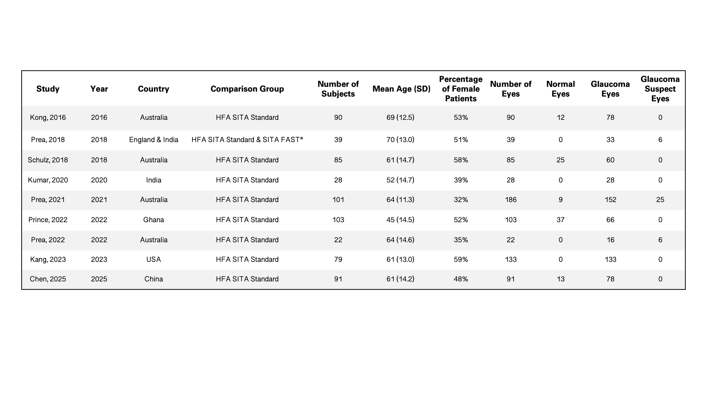

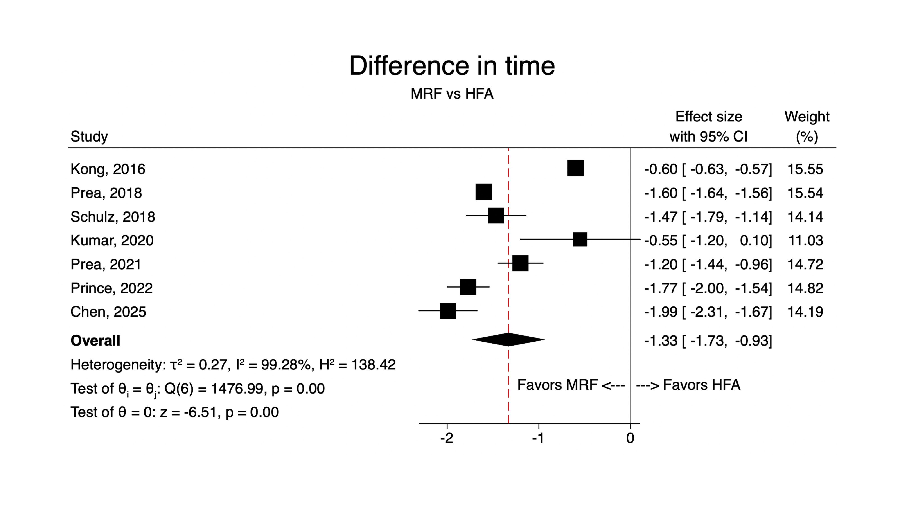

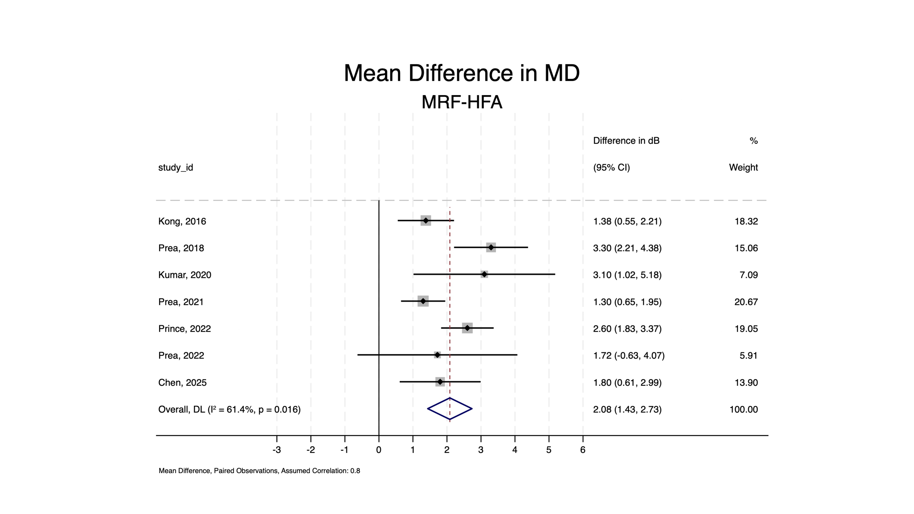

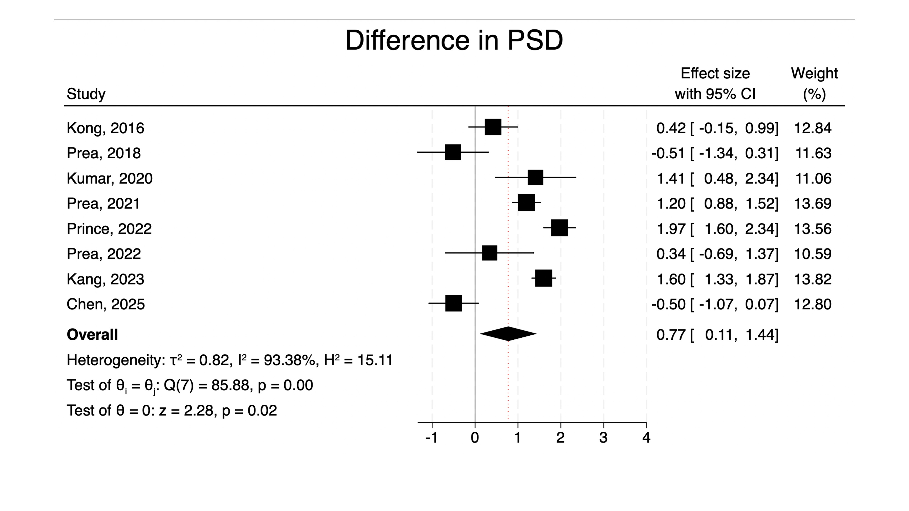

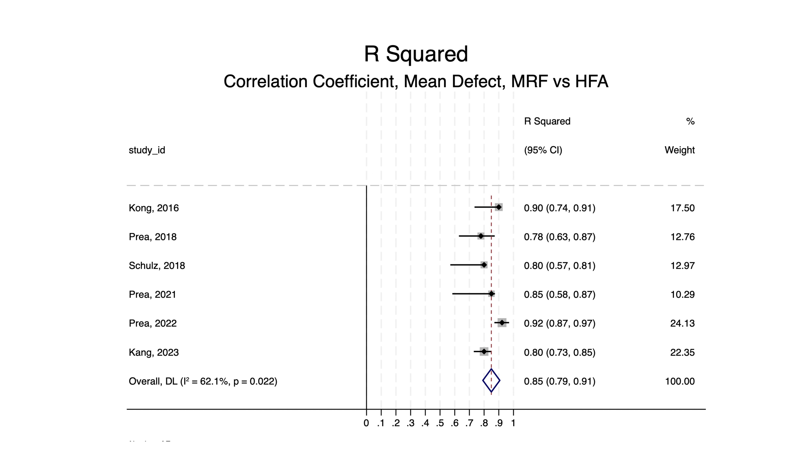

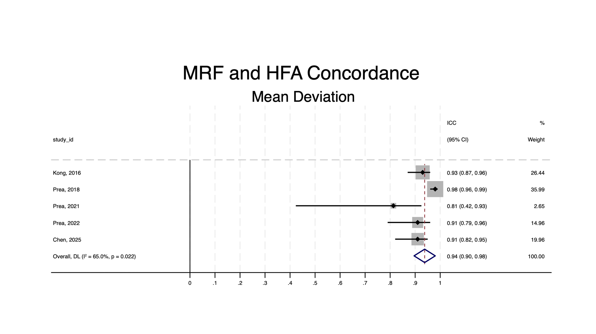

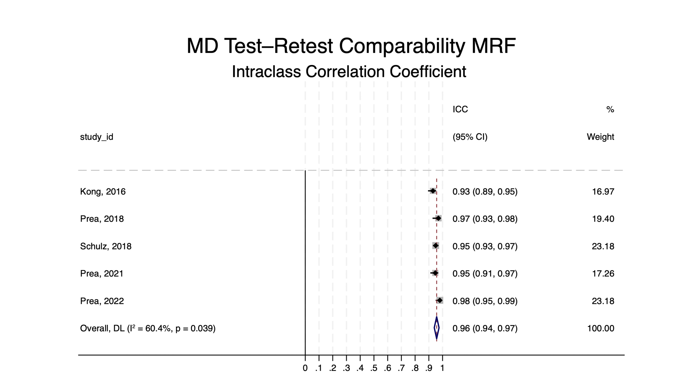

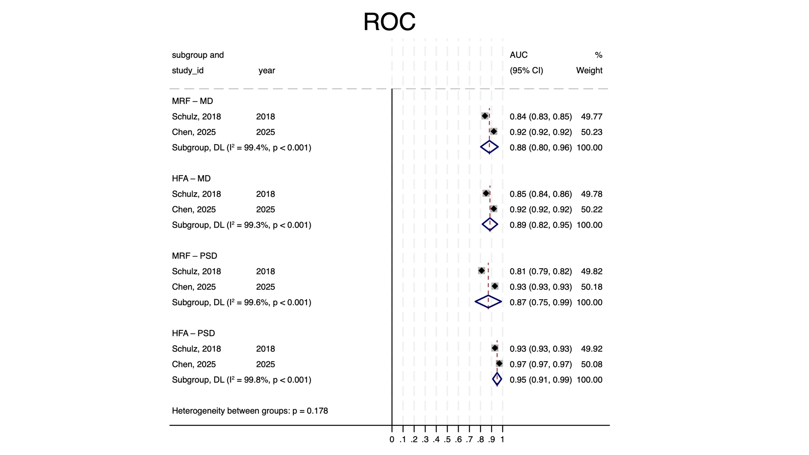

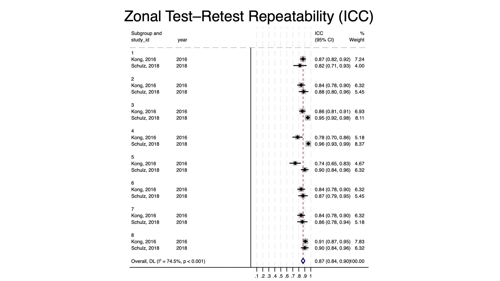

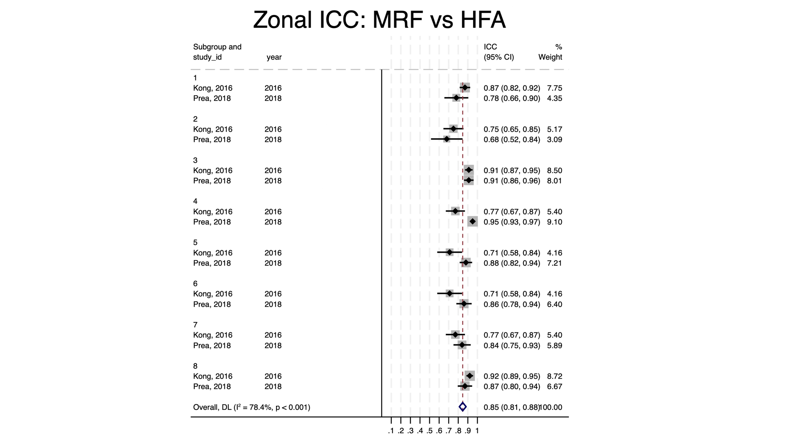

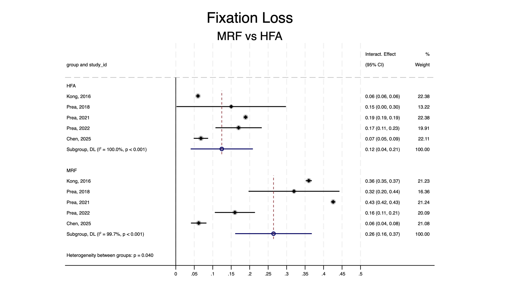

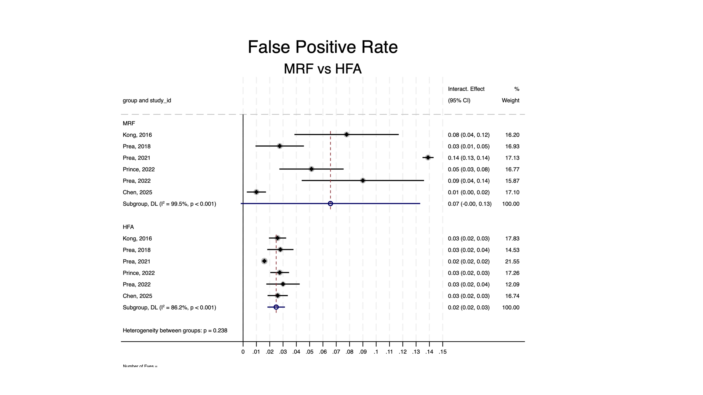

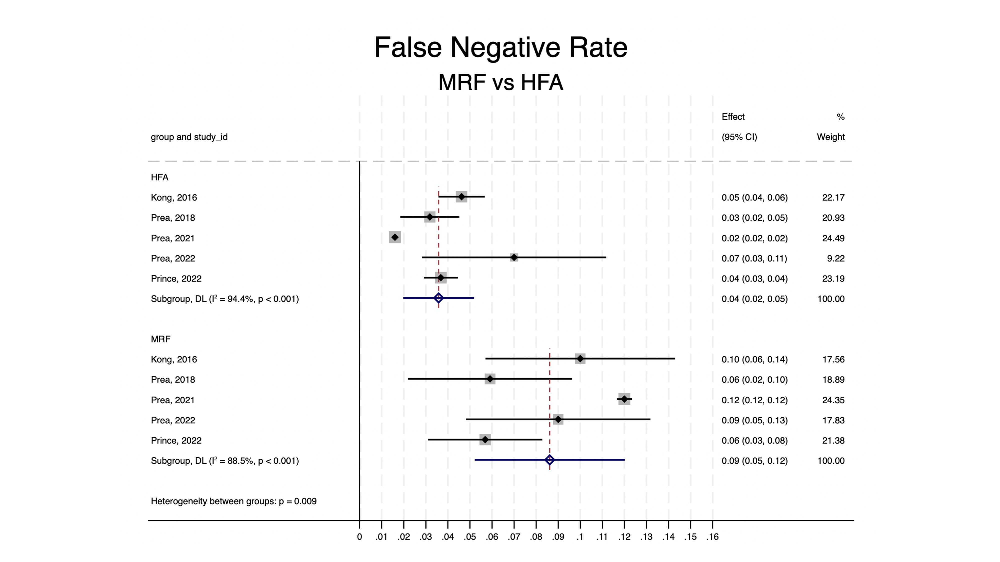
